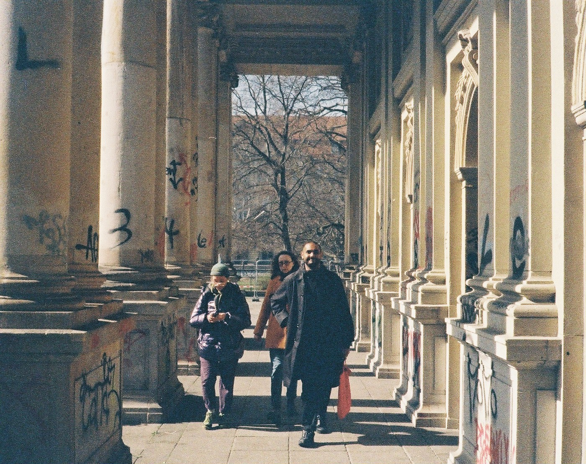
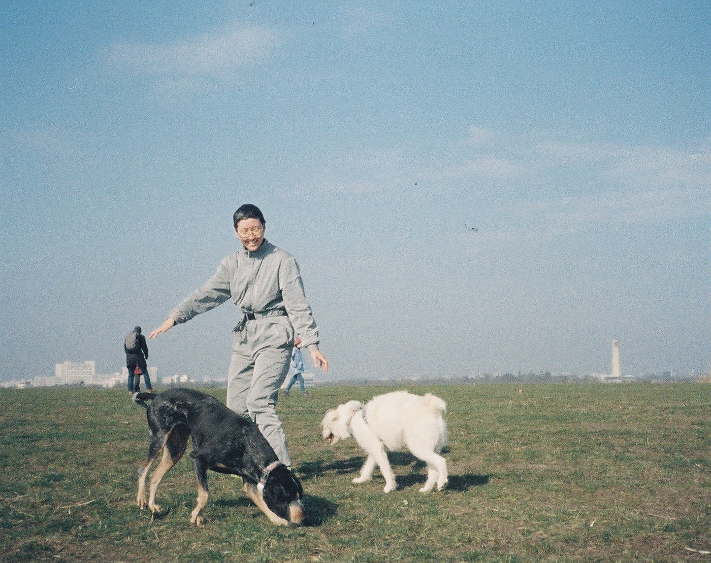
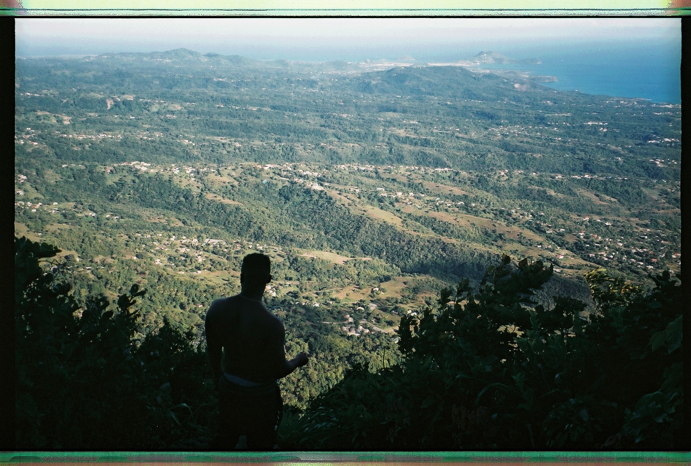
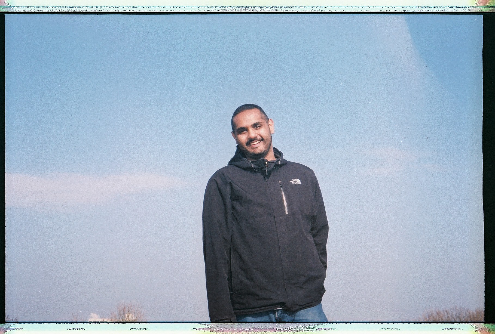

# 2024 april 25

<video controls width="256px">
    <source src="../vid/24-04-25_576.mp4" type="video/mp4">
</video>

1. jin, halina, and brandon, on a walk through schöneberg, berlin

picture

2. jin, frankie, and bongji, drachenberg, berlin

picture

3. alica, alisa, nioucha, and ranesh, at booked, hong kong

picture

4. my favourite midsummer group photo, barsebäck

picture

5. brendan, looking out over the entire country atop gros piton, st lucia

picture

6. brandon's first visit to drachenberg, berlin

picture

music: "21 Questions" by 50 Cent; Nate Dogg
